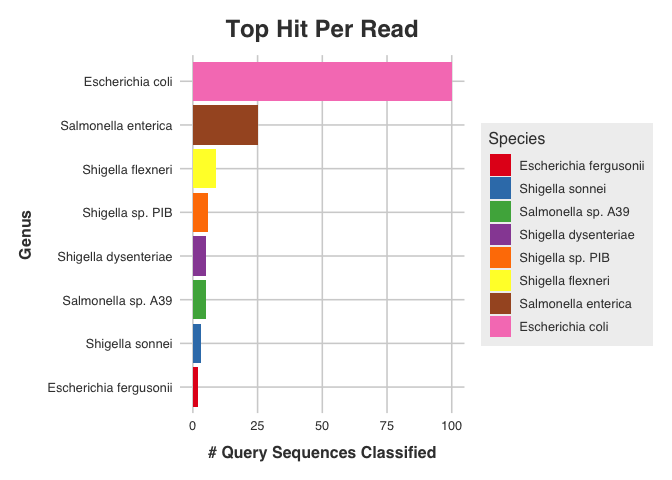

<!-- README.md is generated from README.Rmd. Please edit that file -->

# blastparse

<!-- badges: start -->

[](https://lifecycle.r-lib.org/articles/stages.html#experimental)

<!-- badges: end -->

Parse the results of a nucleotide blast and figure out what species /
genus the blasted sequences are most likely to have come from.

## Installation

You can install the development version of blastparse like so:

``` r
# install.packages("remotes")
remotes::install_github("selkamand/blastparse")
```

## Detailed Description

This package was developed to facilitate validation of species/genus
classifications by metagenomics classifiers such as **Kraken2**.

Often we want to make sure that a group of sequences we think belong to
some species actually belongs to that species, rather than simply being
the closest hit in a relatively small database. By blasting a subset of
these sequence against one of the largest databases around (ncbi nt) we
can gain confidence that our predictions are indeed accurate (or we
learn that we might be completely wrong!)

## Typical Workflow

Start with a bunch of sequences that you think belong to the same
organism. For example, you could start with the reads from a microbiome
WGS study that a metagenomics classifier (e.g. Kraken2) has classified
as *E. coli*. Some simulated data is available within this package (add
link)

Run a subsample of these sequences (100-200 reads) through a nucleotide
blast (against the full ncbi nucleotide database). You will need the
ncbi blast commandline tool installed to do this.

``` r
# Run nucleotide blast
blast_run(query = "path/to/input.fasta", outfile_prefix = "my_samples")

# Run blast against custom database
blast_run(query = "path/to/input.fasta", outfile_prefix = "my_samples" , db = "path/to/blast/database/dbname", remote = FALSE)
```

Next we pull this data into the R package and produce the visualizations
and summaries we need to assess what species we have. We will use
exemplar output created by running `blast_run` on
`system.file("testfiles/simulated_fasta/e_coli_1.100seqs.fasta",package = "blastparse")`

``` r
library(blastparse)
blast_results = system.file("testfiles/simulated_fasta/e_coli_1.100seqs.blastn.tsv",package = "blastparse")

# Parse blast results 
blast <- blast_parse(blast_path = blast_results)
#> Warning: `message_info()` was deprecated in utilitybeltfmt 0.0.0.9000.
#> ℹ Please use `fmt::message_info()` instead.
#> ℹ The deprecated feature was likely used in the blastparse package.
#>   Please report the issue to the authors.
#> This warning is displayed once every 8 hours.
#> Call `lifecycle::last_lifecycle_warnings()` to see where this warning was
#> generated.
#> Warning: `fmtinfo()` was deprecated in utilitybeltfmt 0.0.0.9000.
#> ℹ Please use `fmt::fmtinfo()` instead.
#> ℹ The deprecated feature was likely used in the utilitybeltfmt package.
#>   Please report the issue at
#>   <https://github.com/selkamand/utilitybeltfmt/issues>.
#> This warning is displayed once every 8 hours.
#> Call `lifecycle::last_lifecycle_warnings()` to see where this warning was
#> generated.
#> [ℹ] Checking files exist ...
#> Warning: `message_success()` was deprecated in utilitybeltfmt 0.0.0.9000.
#> ℹ Please use `fmt::message_success()` instead.
#> ℹ The deprecated feature was likely used in the blastparse package.
#>   Please report the issue to the authors.
#> This warning is displayed once every 8 hours.
#> Call `lifecycle::last_lifecycle_warnings()` to see where this warning was
#> generated.
#> Warning: `fmtsuccess()` was deprecated in utilitybeltfmt 0.0.0.9000.
#> ℹ Please use `fmt::fmtsuccess()` instead.
#> ℹ The deprecated feature was likely used in the utilitybeltfmt package.
#>   Please report the issue at
#>   <https://github.com/selkamand/utilitybeltfmt/issues>.
#> This warning is displayed once every 8 hours.
#> Call `lifecycle::last_lifecycle_warnings()` to see where this warning was
#> generated.
#>  [✔] found blast output, config file, and seqnames
#> [ℹ] Reading config file ...
#>  [✔] blast config file contains all expected fields
#> [ℹ] Extracting blast output column names from config file ...
#>  [✔] config file says outfmt type is '6' (supported)
#> [ℹ] Reading blast file
#>  [✔] succesfully read blast file
#> [ℹ] Identifying strong hits using the following formula:
#>  Strong Hit = evalue < 1e-50 & perc_identity > 97 & qcovs > 95
#>  [✔] Identified at least one strong hit for [100] query sequences
#> [ℹ] Ranking hits within each query
#>  [✔] Succesfully ranked hits for each query
#> [ℹ] Converting taxids to scientific names
#>  [✔] Succesfully mapped all taxids to their scientific names
#> [ℹ] Reading Seqname file
#>  [✔] All names in blast results are present in seqname file
#>  [✔] # of names in seqnames file = number blasted according to config file
#> [ℹ] Creating blast object
#>  [✔] Blast object successfully created

# Look at the top microbial hits
blast_top_microbes_barplot(blast, interactive = FALSE)
#> Warning: `fmtpercent()` was deprecated in utilitybeltfmt 0.0.0.9000.
#> ℹ Please use `fmt::fmtpercent()` instead.
#> ℹ The deprecated feature was likely used in the blastparse package.
#>   Please report the issue to the authors.
#> This warning is displayed once every 8 hours.
#> Call `lifecycle::last_lifecycle_warnings()` to see where this warning was
#> generated.
```



``` r

# config files will automatically be found if in same directory, otherwise you'll need to additionally specify the `blast_config_path` paramater when running blast_parse
```

Finally, we generate a html report describing the results

``` r
# In progress
#report <- blast_report(blast)
```
